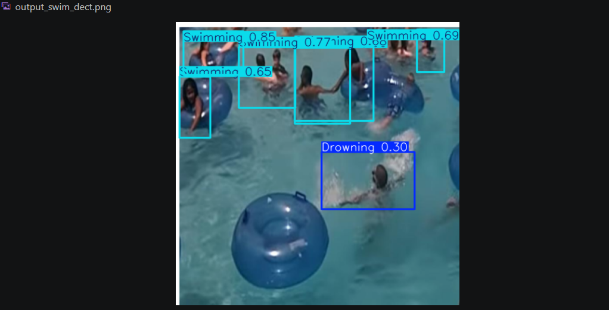
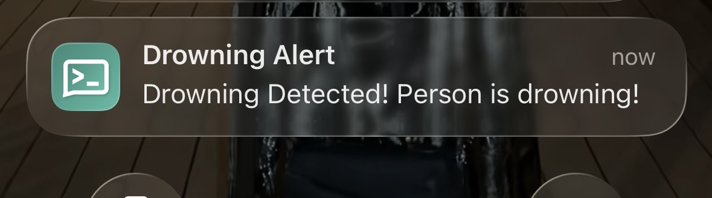
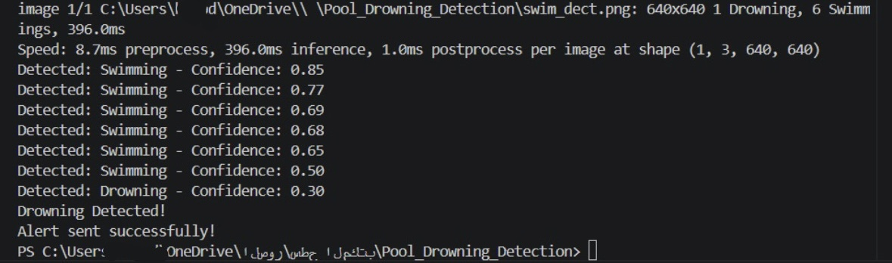

# Real-Time-Pool-Drowning-Detection-and-Alert-System
#overview

An AI-powered computer vision system designed to detect drowning incidents in swimming pools in real time and automatically trigger instant alerts to support faster emergency response.

#Features
Real-time drowning detection
Automated alert and notification system
Video frame analysis using Computer Vision
Deep Learning-based classification
Real-time monitoring for enhanced pool safety
#Technologies Used
Python
YOLOv11l (Ultralytics)
Roboflow
Kaggle
ntfy Notifications
VS Code
#Model Performance
Metric	Score
mAP50	93.3%
Precision	94.2%
Recall	88.4%

#Training Dataset:

9,900+ Images
Classes: Swimming & Drowning
Training Epochs: 150
GPU: Tesla T4
#Project Screenshots
## Detection Result

## Alert System

## Model Performance

#Future Improvements
Integration with real-time CCTV cameras
IoT-based deployment using sensors and edge devices
Enhanced alert mechanisms for emergency responders
Multi-person tracking and monitoring

#Author

Fatima Al-Ibrahim.
